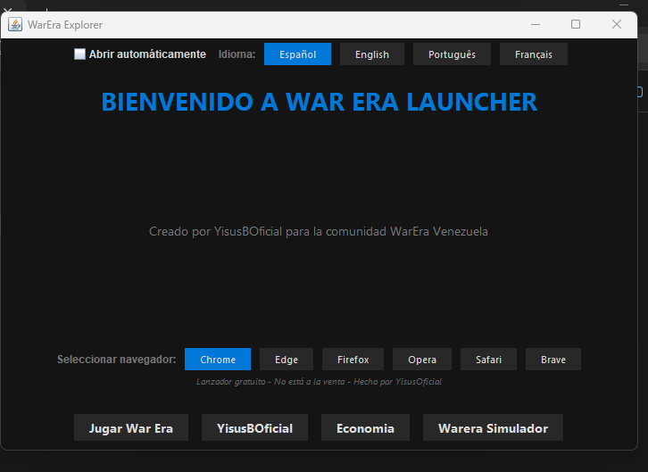
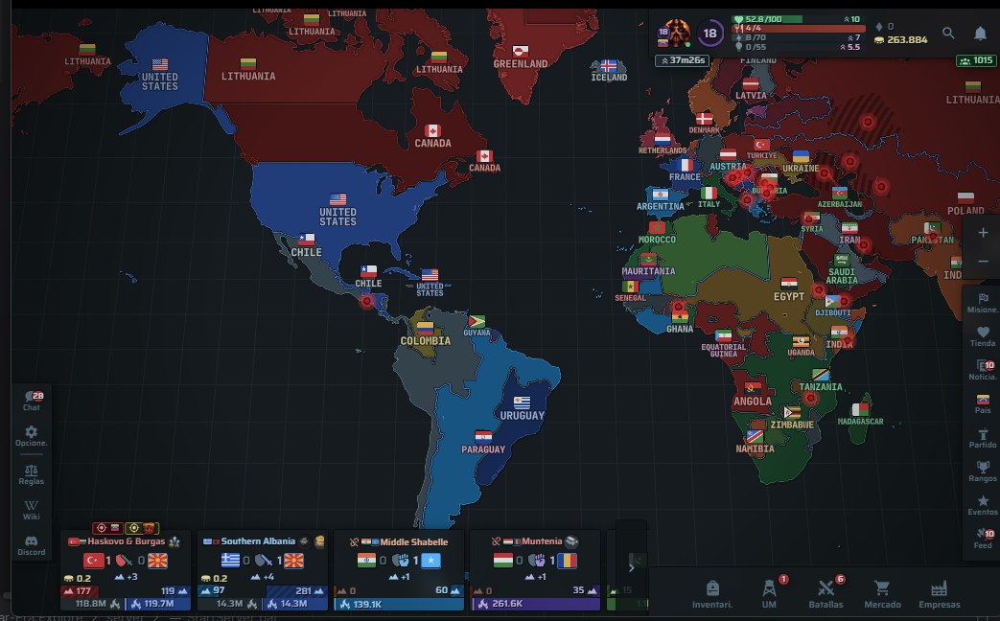
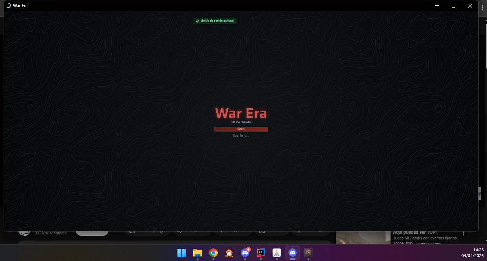
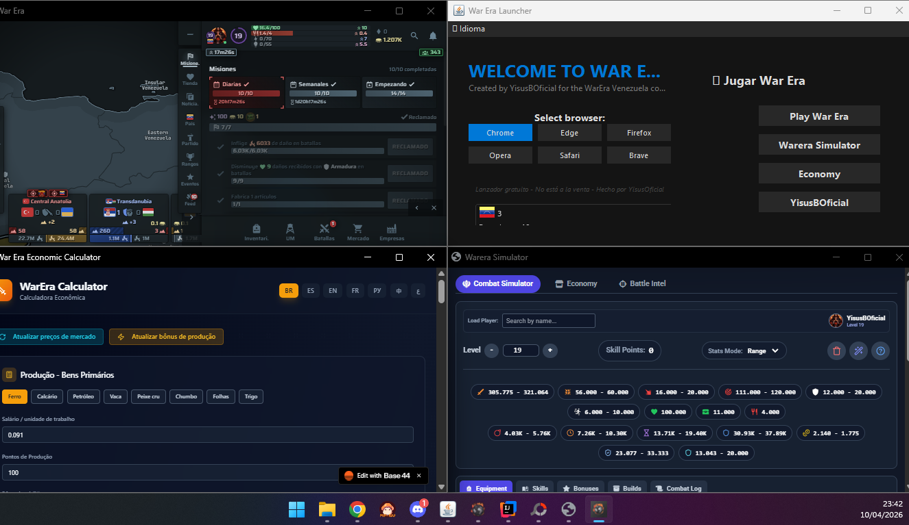
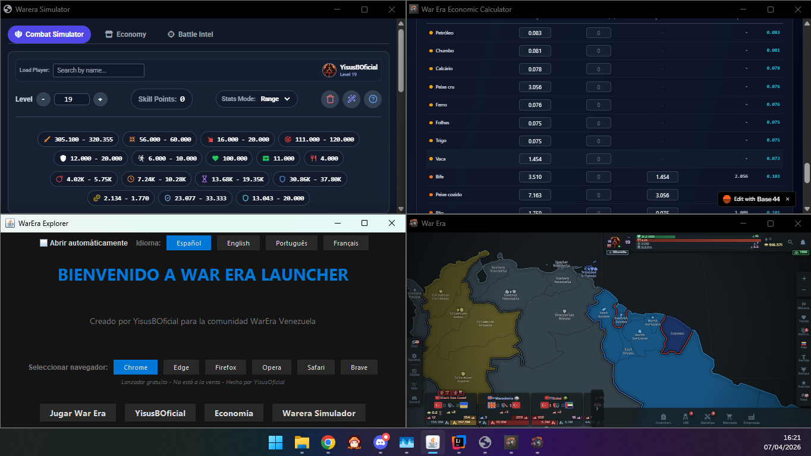

War Era Launcher is a desktop tool designed exclusively for the War Era Venezuela community. Created by YisusBOficial, this launcher streamlines access to the game, simulators, and economic tools, optimizing the overall experience for Venezuelan strategists.

Cross-Platform: Native support for Windows and Linux/Ubuntu systems.

Browser Selector: Choose your preferred engine for better performance (Chrome, Edge, Firefox, Opera, Safari, Brave).

Quick Access: Fast-action buttons for:

Play War Era: Join the battlefield instantly.

Warera Simulator: Test your tactics before deployment.

Economy: Manage your resources and companies efficiently.

Intuitive Interface: Modern dark design, minimalist and distraction-free.

Easy to Use: Just double-click. Requires Java 23 or JDK.

War Era Launcher es una herramienta de escritorio diseñada exclusivamente para la comunidad de War Era Venezuela. 
Creado por YisusBOficial, este launcher facilita el acceso al juego, simuladores y herramientas económicas, optimizando la experiencia para los estrategas venezolanos.
Multiplataforma: Soporte nativo para sistemas Windows y Linux/Ubuntu.

Selector de Navegador: Elige tu motor preferido para una mejor fluidez (Chrome, Edge, Firefox, Opera, Safari, Brave).

Acceso Directo: Botones rápidos para:

 Jugar War Era: Entra al campo de batalla al instante.

 Warera Simulador: Prueba tus tácticas antes del despliegue.

 Economía: Gestiona tus recursos y empresas de forma eficiente.

Interfaz Intuitiva: Diseño oscuro moderno y minimalista para evitar distracciones.

Facil  de usar  Doble clic  usar java 23  o jdk 

Aquí tienes la traducción de esa parte tan importante. Captura muy bien ese sentimiento de comunidad y el esfuerzo que le pusiste durante todo el mes de trabajo:

English Version:
This was created to make everything easier for players, keeping everything within reach. There’s no need to open a browser and search for URLs—everything is just one click away.

I AM NOT LOOKING FOR CREDIT FOR THIS LAUNCHER.
As a member of this community, I saw that new players and novices needed a tool like this. What started as a personal project for my own use is now being shared with the entire player community.

I hope you enjoy it. I’ve given my absolute best to this project over the past month.

Esto es creado  para facilitar a los jugadores a tener todo a la mano
sin necesidad de abrir y buscar las URL todo solo dale clic

NO QUIERO GANAR CREDITOS POR ESTE LAUNCHER O INICIADOR 
como soy de una comunidad vi que necesitaban esto para los jugadores nuevo 
 Novato esto comenzo como un proyecto para mi personal y ahora lo pase para toda una comunidad de jugadores
espero que le guste hice toda lo mejor de mí después de 1 mes 

⚖️ Licencia ⚖️
Este proyecto se distribuye bajo la licencia GNU General Public License v3.0 (GPLv3).
Lanzador gratuito - No está a la venta. Hecho por la comunidad, para la comunidad.